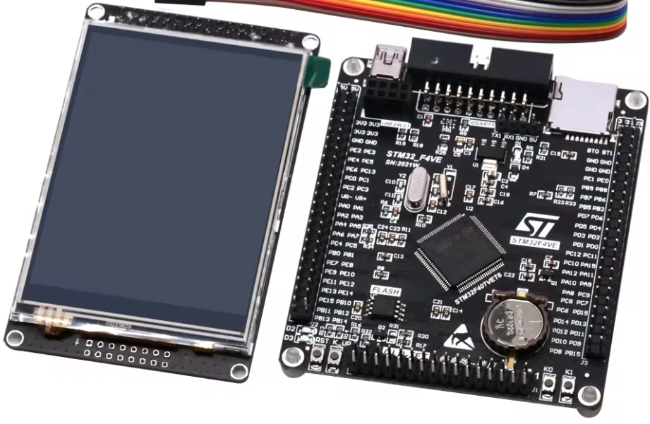

# EU-STM32F407VET6 开发板

- LCD 资料：http://www.lcdwiki.com/2.4inch_16BIT_Module_ILI9341_SKU:MRB2408

- 原理图: [点此打开](figures/EU-STM32F407VE_Schematics.pdf)




### 快速上手

本 BSP 为开发者提供 MDK4、MDK5 工程，并且支持 GCC 开发环境，也可使用RT-Thread Studio开发。下面以 MDK5 开发环境为例，介绍如何将系统运行起来。

```
$ git clone https://github.com/RT-Thread/rt-thread/tree/master/bsp/stm32/stm32f407-lckfb-skystar/board/CubeMX_Config
$ cd rt-thread/bsp/stm32/
$ git clone https://github.com/wuhanstudio/stm32f407-vet6-ili9341
$ cd stm32f407-vet6-ili9341
$ pkgs --update
$ scons
```

#### 硬件连接

使用数据线连接开发板到 PC，使用USB转TTL模块连接PA9(MCU TX)和PA10(MCU RX)，上电。

根据需要修改 LCD (FSMC 16bit A18) 引脚：
```
> drv_lcd_fsmc_16.h
#define LCD_RST           C, 5  /* If not used leave it that way */
#define LCD_BL            B, 0  /* If not used leave it that way */
#define LCD_ADDR_BASE     0x60000000
#define LCD_REGSELECT_BIT 18   /* A18, should be 16 for A16 */
```
当然，也需要修改对应引脚的初始化。
```
> drv_lcd_fsmc_16.c

// PB0 Backlight
 GPIO_InitStruct.Pin = GPIO_PIN_0;
 GPIO_InitStruct.Mode = GPIO_MODE_OUTPUT_PP;
 GPIO_InitStruct.Pull = GPIO_PULLUP;
 GPIO_InitStruct.Speed = GPIO_SPEED_FREQ_VERY_HIGH;
 HAL_GPIO_Init(GPIOB, &GPIO_InitStruct);

// PC5 Reset
GPIO_InitStruct.Pin = GPIO_PIN_5;
GPIO_InitStruct.Mode = GPIO_MODE_OUTPUT_PP;
GPIO_InitStruct.Pull = GPIO_PULLUP;
GPIO_InitStruct.Speed = GPIO_SPEED_FREQ_VERY_HIGH;
HAL_GPIO_Init(GPIOC, &GPIO_InitStruct);
```
触摸屏的 XPT2046 使用的是软件 SPI，所以只需在 `menuconfig` 里修改
```
On-chip peripheral Drivers -->
    [*] Enable soft SPI BUS -->
        [*] Enable soft SPI1 BUS (software simulation) -->
            --> 修改 SCK MISO MOSI 的引脚
```
由于默认挂载了 SPI2 上的 W25Q64 Nor Flash，根据需要修改 SPI Flash 的总线：
```
>spi_flash_init.c

static int rt_hw_spi_flash_init(void)
{
    __HAL_RCC_GPIOB_CLK_ENABLE();
    rt_hw_spi_device_attach("spi2", "spi20", GET_PIN(B, 12));

    if (RT_NULL == rt_sfud_flash_probe("W25Q64", "spi20"))
    {
        return -RT_ERROR;
    }

    return RT_EOK;
}
INIT_COMPONENT_EXPORT(rt_hw_spi_flash_init);
```

#### 编译下载

双击 project.uvprojx 文件，打开 MDK5 工程，编译并下载程序到开发板。

> 工程默认配置使用 CMSIS-DAP 仿真器下载程序，在通过 CMSIS-DAP 连接开发板的基础上，点击下载按钮即可下载程序到开发板

#### 运行结果

下载程序成功之后，系统会自动运行，LED 闪烁。

连接开发板对应串口到 PC , 在终端工具里打开相应的串口（115200-8-1-N），复位设备后，可以看到 RT-Thread 的输出信息:

```bash
 \ | /
- RT -     Thread Operating System
 / | \     5.1.0 build Apr 13 2024 11:59:40
 2006 - 2024 Copyright by RT-Thread team

```


## 外设支持

本 BSP 目前对外设的支持情况如下：

| **片上外设** | **支持情况** | **备注**                        |
| :----------- | :----------: | :------------------------------ |
| GPIO         |     支持     | PA0, PA1... ---> PIN: 0, 1...81 |
| UART         |     支持     | UART0 - UART6                   |
| I2C          |     支持     | I2C1                            |
| SPI          |     支持     | SPI0 -  SPI2                    |
| ADC          |     支持     | ADC0 - ADC2                     |
| TF CARD      |     支持     | SDIO                            |
| SPI FLASH    |     支持     | SPI1                            |
| LCD          |     支持     | FSMC 16Bit (ili9341)            |
| **扩展模块** | **支持情况** | **备注**                        |
| 暂无         |   暂不支持   | 暂不支持                        |
